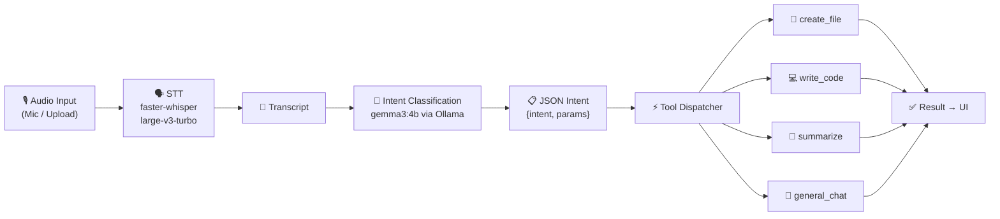

# 🎙️ Voca — Voice-Controlled Local AI Agent

A **fully local, privacy-preserving voice agent** that accepts spoken commands, transcribes them, understands intent, and executes real actions on your filesystem — all through a clean web UI. No cloud APIs. No data leaves your machine.

---

## System Requirements

| Component | Requirement |
|---|---|
| **Python** | 3.12+ |
| **GPU** | NVIDIA with CUDA support (RTX 4050 / 6 GB VRAM recommended) |
| **CUDA Toolkit** | 12.x (matching your GPU driver) |
| **Ollama** | v0.5+ ([ollama.com](https://ollama.com)) |
| **VRAM Budget** | ~4 GB Whisper (float16) + ~3 GB Gemma 3 4B ≈ 7 GB total |
| **OS** | Windows 10/11, Linux, macOS (CUDA on Win/Linux only) |

---

## Installation

### 1. Clone the repository

```bash
git clone <your-repo-url>
cd Voca
```

### 2. Install dependencies with uv

```bash
# Install uv if you don't have it
pip install uv

# Create virtual environment and install all dependencies
uv sync
```

### 3. Pull the Ollama model

```bash
ollama pull gemma3:4b
```

### 4. Verify Ollama is running

```bash
ollama list   # Should show gemma3:4b
```

---

## Running the App

```bash
uv run python app.py
```

This launches a FastAPI server at `http://localhost:7860`. Open it in your browser, record or upload audio, and click **Run Agent**.

---

## Pipeline Diagram



### Text version

```
Audio Input → STT (faster-whisper) → Transcribed Text
    → Intent Classification (gemma3:4b via Ollama, JSON output)
    → Tool Dispatcher (Python switch logic)
    → Result (file created / code written / summary shown)
    → UI Display (FastAPI + Custom Frontend)
```

---

## Supported Intents

| Intent | Trigger Examples | Action |
|---|---|---|
| `create_file` | "Create a file called notes.txt" | Creates empty file in `output/` |
| `write_code` | "Write a Python script that sorts a list" | Generates code via LLM, saves to `output/` |
| `summarize` | "Summarize the following: ..." | Returns a concise summary |
| `general_chat` | "Hello", "What is Python?" | Conversational response |

---

## Example Interactions

### 1. Create a file
> 🎙️ *"Create a file called shopping_list.txt"*

| Stage | Output |
|---|---|
| Transcript | "Create a file called shopping_list.txt" |
| Intent | `{"intent": "create_file", "filename": "shopping_list.txt"}` |
| Action | `create_file` |
| Result | `📄 Created file: output/shopping_list.txt` |

### 2. Generate code
> 🎙️ *"Write a Python function that calculates the Fibonacci sequence"*

| Stage | Output |
|---|---|
| Transcript | "Write a Python function that calculates the Fibonacci sequence" |
| Intent | `{"intent": "write_code", "filename": "fibonacci.py", "language": "python", "description": "calculates the Fibonacci sequence"}` |
| Action | `write_code` |
| Result | *(generated Python code displayed and saved to `output/fibonacci.py`)* |

### 3. Summarize text
> 🎙️ *"Summarize this: Machine learning is a subset of artificial intelligence..."*

| Stage | Output |
|---|---|
| Transcript | "Summarize this: Machine learning is a subset..." |
| Intent | `{"intent": "summarize", "content": "Machine learning is a subset..."}` |
| Action | `summarize` |
| Result | *(concise summary text)* |

### 4. General chat
> 🎙️ *"What's the weather like?"*

| Stage | Output |
|---|---|
| Transcript | "What's the weather like?" |
| Intent | `{"intent": "general_chat", "message": "What's the weather like?"}` |
| Action | `general_chat` |
| Result | *(conversational response)* |

---

## Safety: The `output/` Directory Boundary

**All file operations are restricted to the `output/` subdirectory.** This is enforced by the `safe_path()` utility in `tools.py`:

- Strips `..` path traversal sequences
- Resolves all paths relative to `output/`
- Raises a `ValueError` if any resolved path escapes the boundary

This means the agent **cannot** create, modify, or delete files anywhere else on your system — even if instructed to do so via voice command.

---

## STT Decision Note

This project uses **faster-whisper** with the `large-v3-turbo` model running locally on GPU with `float16` precision. This gives:

- **4–6× speedup** over the standard HuggingFace Whisper pipeline
- **No cloud API dependency** — full privacy
- **~4 GB VRAM** usage, leaving room for the LLM

If your hardware does not support CUDA or has insufficient VRAM, you can:
1. Switch to `compute_type="int8"` to reduce VRAM usage
2. Use `device="cpu"` (significantly slower, ~30s for 10s audio)
3. Use a smaller model: `base`, `small`, or `medium`

---

## Project Structure

```
Voca/
├── app.py              ← FastAPI backend entry point
├── static/
│   ├── index.html      ← Custom web UI
│   ├── style.css       ← Premium dark theme with glassmorphism
│   └── script.js       ← Mic recording, uploads, API calls
├── stt.py              ← Speech-to-Text module (faster-whisper)
├── intent.py           ← Intent classification (gemma3:4b via Ollama)
├── tools.py            ← Tool execution + path safety
├── pipeline.py         ← Orchestrator wiring all modules
├── output/             ← ALL generated files go here (sandboxed)
├── pyproject.toml      ← Project config & dependencies (uv)
└── README.md           ← This file
```

---

## Tech Stack

| Component | Choice | Why |
|---|---|---|
| STT | `faster-whisper` + `large-v3-turbo` | 4–6× faster than HF pipeline; float16 CUDA; open-source |
| LLM | `gemma3:4b` via Ollama | Strong instruction-following; excellent JSON output; 4B params |
| UI | FastAPI + Custom HTML/CSS/JS | Full design control; premium glassmorphism dark theme |
| Environment | `uv` | Fast, modern Python package manager |
| Audio I/O | `sounddevice` + `soundfile` | Lightweight; no system deps |

---

## License

MIT
